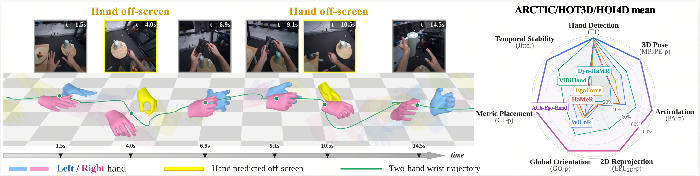

<div align="center">

# ACE-Ego-Hand: Repurposing Video Diffusion Models for<br>Occlusion-Robust Egocentric 3D Hand Motion Recovery

[Yufei Liu](https://ggxxii.github.io/)<sup>1,4</sup>,
Xixi Wang<sup>2</sup>,
[Hao Li](https://scholar.google.com/citations?view_op=list_works&hl=zh-CN&hl=zh-CN&user=D-8csxoAAAAJ)<sup>3,4</sup>,
[Ganlong Zhao](https://scholar.google.com/citations?user=4l2zOz4AAAAJ&hl=zh-CN)<sup>3,4</sup>,
Kaitong Cai<sup>4</sup>,
Chengkai Jin<sup>2,4</sup>,
Chunxiao Liu<sup>4</sup>,
Jianbo Liu<sup>4</sup>,
[Siyuan Huang](https://scholar.google.com/citations?user=QNkS4KEAAAAJ&hl=en)<sup>4</sup>&nbsp;&#8224;,
[Xingang Pan](https://xingangpan.github.io/)<sup>2</sup>,
[Hongsheng Li](https://scholar.google.com/citations?user=BN2Ze-QAAAAJ&hl=en)<sup>3,4</sup>&nbsp;&#9993;

<sup>1</sup>SJTU &nbsp; <sup>2</sup>NTU &nbsp; <sup>3</sup>CUHK &nbsp; <sup>4</sup>ACE Robotics
&nbsp;&nbsp; <sub>&#8224; Project leader &nbsp; &#9993; Corresponding author</sub>

[](https://arxiv.org/abs/2608.20308)
[](https://ggxxii.github.io/ace-ego-hand/)
[](https://pytorch.org/)
[](LICENSE)



</div>

Bimanual 3D hand motion — MANO pose, shape and camera-space translation, per
frame — from egocentric RGB video, through occlusion and out-of-sight gaps, with
no external hand detector. **This repository ships inference only**; training
code is not included yet (see the TODO).

## Requirements

```bash
conda create -n ace-ego-hand python=3.10 && conda activate ace-ego-hand
pip install -r requirements.txt
```

The Wan backbone is loaded through VideoX-Fun. Clone it to
`third_party/`:

```bash
git clone https://github.com/aigc-apps/VideoX-Fun third_party
```

MANO drives the translation decode. Get the official release
([mano.is.tue.mpg.de](https://mano.is.tue.mpg.de), research licence) and convert
it once — the official pickles embed `chumpy`, which no longer imports on modern
numpy, so the converter rewrites them as plain-numpy pickles:

```bash
python scripts/convert_mano_pkls.py --src /path/to/mano_v1_2/models --dst data/mano/mano
```

## Download checkpoints

Download `Wan2.2-Fun-5B-Control` from the VideoX-Fun release to
`ckpt/Wan2.2-Fun-5B-Control/` (needs `config.json`,
`diffusion_pytorch_model.safetensors`, `Wan2.2_VAE.pth`,
`models_t5_umt5-xxl-enc-bf16.pth` and `google/umt5-xxl/`), then precompute the
fixed caption embedding once:

```bash
python scripts/precompute_caption.py
```

Ours come from [🤗 acerobotics2025/ACE-Ego-Hand](https://huggingface.co/acerobotics2025/ACE-Ego-Hand)
and go in `checkpoints/`:

| model | checkpoint | camera intrinsics | |
|---|---|---|---|
| K-given | `ace_ego_hand_k.pt` | required | [download](https://huggingface.co/acerobotics2025/ACE-Ego-Hand/resolve/main/ace_ego_hand_k.pt) |
| K-free | `ace_ego_hand_kfree.pt` | not needed | [download](https://huggingface.co/acerobotics2025/ACE-Ego-Hand/resolve/main/ace_ego_hand_kfree.pt) |

> ⚠️ **Pinhole only.** The two released checkpoints do not support native
> fisheye input. To run on fisheye footage, undistort it to a pinhole view
> first and pass the pinhole intrinsics.

```bash
pip install -U "huggingface_hub[cli]"
hf download acerobotics2025/ACE-Ego-Hand --local-dir checkpoints
```

## Run on a video

```bash
# K-free: no camera parameters needed at all
python infer_video.py --video clip.mp4 \
    --opt options/ace_ego_hand_kfree.yml --ckpt checkpoints/ace_ego_hand_kfree.pt \
    --out results/clip

# K-given: pass the camera calibration
python infer_video.py --video clip.mp4 --camera cam.json \
    --opt options/ace_ego_hand_k.yml --ckpt checkpoints/ace_ego_hand_k.pt \
    --out results/clip
```

`cam.json` looks like this — intrinsics are taken as constant over the clip, in
the calibration's own pixel grid, and are rescaled automatically if the video
resolution differs (`--intrinsics fx,fy,cx,cy` is an inline shorthand):

```json
{"image_width": 1280, "image_height": 720,
 "frames": [{"intrinsics": {"fx": 736.6, "fy": 736.6, "cx": 640.0, "cy": 360.0}}]}
```

The predictions land in one pickle per clip. To see them, render an overlay
(`--mesh` shades the MANO mesh through a built-in CPU rasterizer, so no GPU
renderer is needed):

```bash
python scripts/viz_preds.py --pred_dir results/clip --video clip.mp4 \
    --out results/clip_viz --mesh
```

## TODO

- [x] [arXiv preprint](https://arxiv.org/abs/2608.20308)
- [x] [Project page](https://ggxxii.github.io/ace-ego-hand/)
- [x] Inference code
- [x] Pretrained checkpoints — K-given and K-free
- [ ] Evaluation code
- [ ] Fisheye support
- [ ] Training code and data preparation scripts

## Acknowledgement

Built on [VideoX-Fun](https://github.com/aigc-apps/VideoX-Fun) /
[Wan](https://github.com/Wan-Video/Wan2.2) and
[smplx](https://github.com/vchoutas/smplx).

## License

The code is MIT (see [LICENSE](LICENSE)). The checkpoints are CC BY-NC 4.0 —
they derive from MANO and research-licensed datasets (ARCTIC, HOT3D, H2O,
OakInk2, FreiHAND, RHD, Re:InterHand), so commercial use is not permitted. The
Wan weights, VideoX-Fun and MANO remain under their own licences.

## BibTeX

```bibtex
@misc{liu2026aceegohand,
    title={ACE-Ego-Hand: Repurposing Video Diffusion Models for Occlusion-Robust Egocentric 3D Hand Motion Recovery},
    author={Yufei Liu and Xixi Wang and Hao Li and Ganlong Zhao and Kaitong Cai and Chengkai Jin and Chunxiao Liu and Jianbo Liu and Siyuan Huang and Xingang Pan and Hongsheng Li},
    year={2026},
    eprint={2608.20308},
    archivePrefix={arXiv},
    primaryClass={cs.CV},
    url={https://arxiv.org/abs/2608.20308},
}
```
