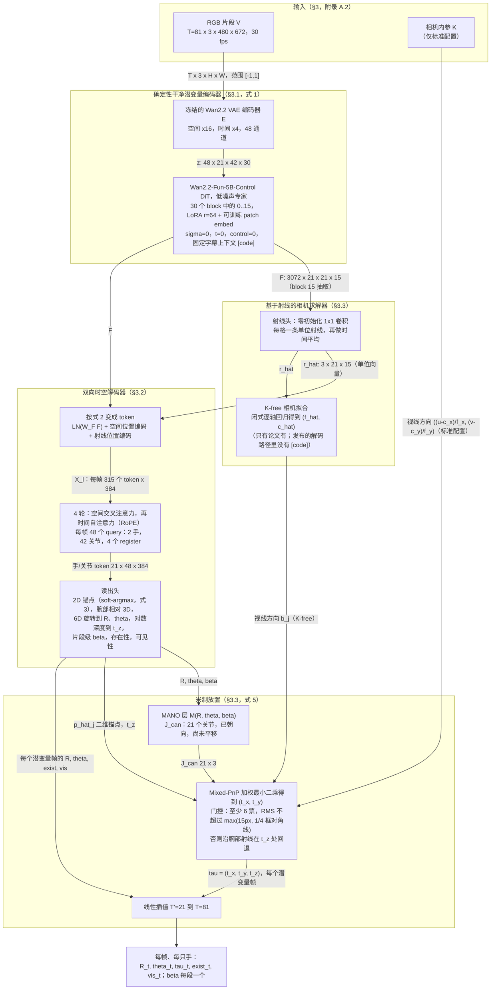
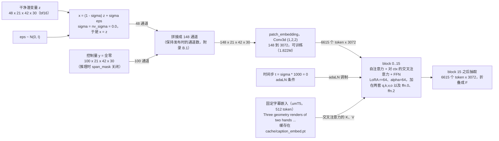
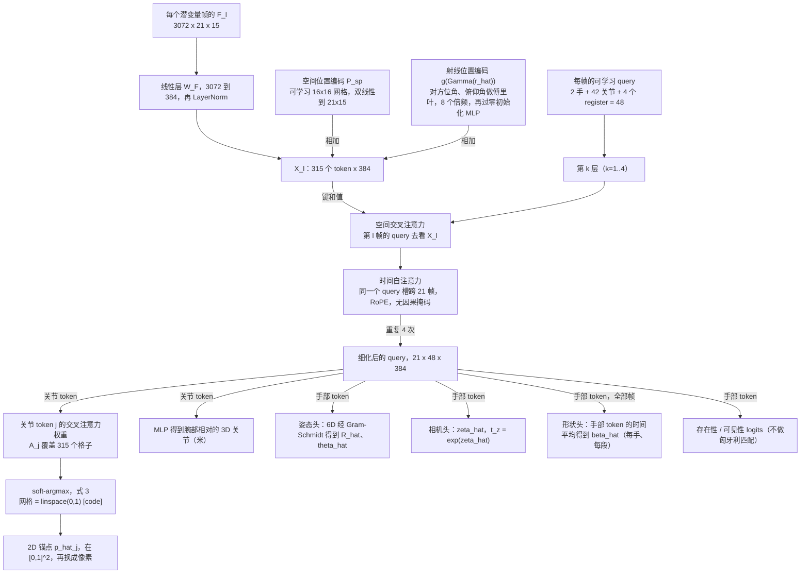
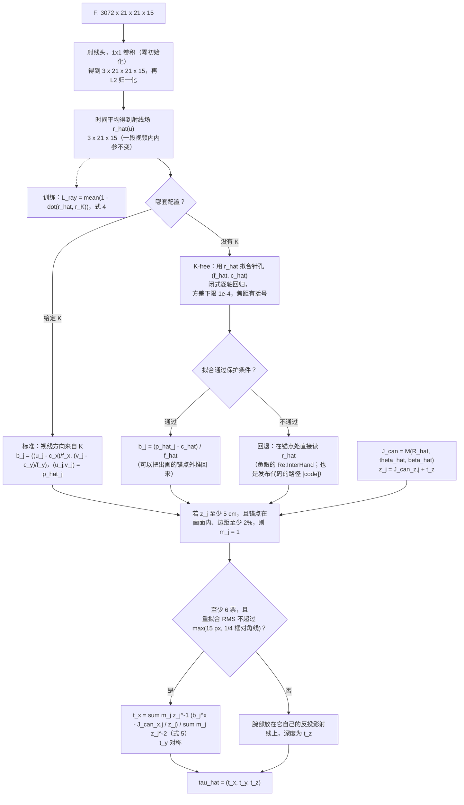
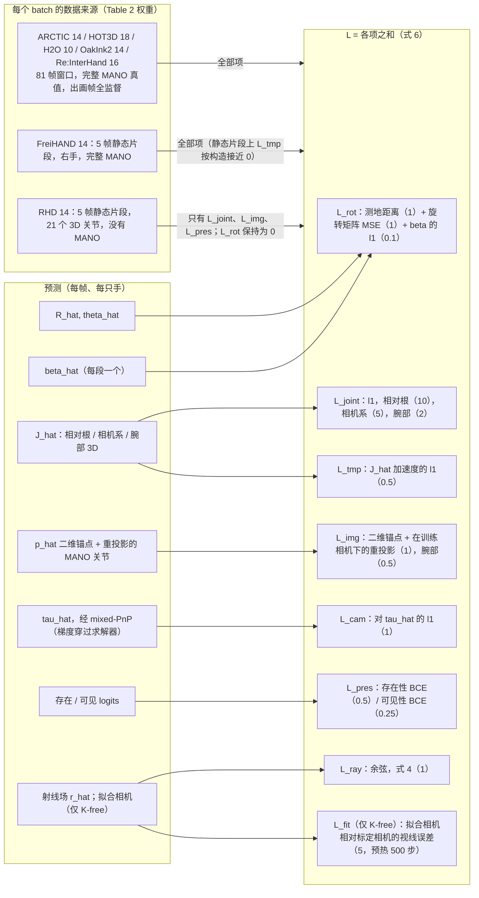
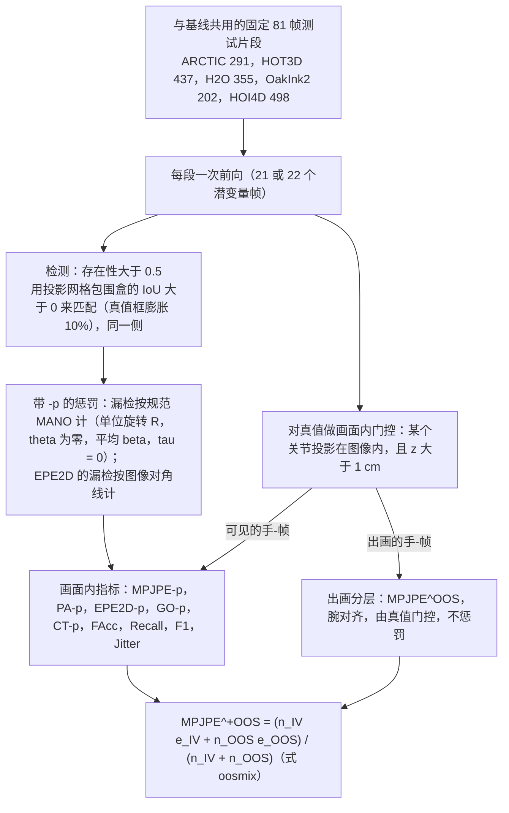

# ACE-Ego-Hand：方法流程图

每个框的依据：括号里的论文章节 / 公式编号（`main.tex` v2），或者当已发布仓库（`ggxxii/ACE-Ego-Hand` @ `9757868`）是唯一来源、或比论文更精确时，标 `[code]`。形状按 ARCTIC 设定（81 帧，672×480）。论文和代码不一致时，图上画代码的值，并标出分歧（见 `ace-ego-hand-notes.md` §6.2 和 `gaps_filled.md`）。

形状图例：`T=81` 帧 RGB，`T'=21` 个潜变量帧，`Hl × Wl = 42×30` 的 VAE 潜变量网格（16 像素），`Hp × Wp = 21×15` 的 DiT token 网格（32 像素，`[code]` 默认 `tap_grid=patch`），骨干宽度 `D=3072`，解码器宽度 `d=384`。

---

## 图 1：推理管线（一次确定性前向）

说明：论文把特征网格写成 `42×30` 个 `16×16` 像素的格子、`D=3072`（§3.1）。发布代码在不做 pixelshuffle 的情况下直接折叠 DiT token，没有撤销 `(1,2,2)` 的 patch，得到的是 `21×15` 个 `32×32` 像素的格子；pixelshuffle 变体（`tap_grid=pixelshuffle`，在 `42×30` 上通道为 `D/4=768`）代码里有，但发布配置没开。

---

## 图 2：σ = 0 时编码器怎么拼输入（`[code]` `geodit_arch.py::extract_features`，`feature_mode=noised_video`）

block 16..29 和扩散输出头从不执行（附录 B.1：它们的 LoRA `B` 矩阵始终精确为零）。

---

## 图 3：解码器：带空间锚的 query 与交替注意力（§3.2，附录 B.1）

配置锚点，`[code]` `options/ace_ego_hand_k.yml`：`hidden_dim: 384`，`num_heads: 8`，`ffn_mult: 4`，`dropout: 0.0`，`alt_num_layers: 4`，`alt_num_register: 4`，`alt_query_mode: joint`，`alt_temporal_rope: true`，`betas_scope: per_hand`，`per_hand_betas_source: slot_mean`，`use_ray_pe: true`，`ray_pe_n_freqs: 8`。

---

## 图 4：基于射线的相机求解与 mixed-PnP 的分支（§3.3，式 4–5，附录 B.1）

两套配置是分开训练的模型，各自有自己的视线来源（§3.3）；Table 1 里的 K-free 行不是测试时把求解器换一下。

---

## 图 5：训练目标怎么路由（§3.4，式 6，附录 B.3）

优化器（附录 B.2）：AdamW，权重衰减 1e-2，梯度裁剪 1.0，余弦，预热 200 步，共 20k 步；学习率：解码器+头 2e-4，LoRA 1e-4，patch embed 2e-5；每张 GPU 4 个片段；标准配置 16 张 A100（有效 batch 64），K-free 为 8 张 A100（有效 batch 32）。

---

## 图 6：评测协议（附录 A.1）

未发布的：片段 ID（HOT3D 自定义的 126/72 录像划分、OakInk2 的 202 子集、HOI4D 的 498 段）以及评分程序本身（GitHub issue #5、#6）。
