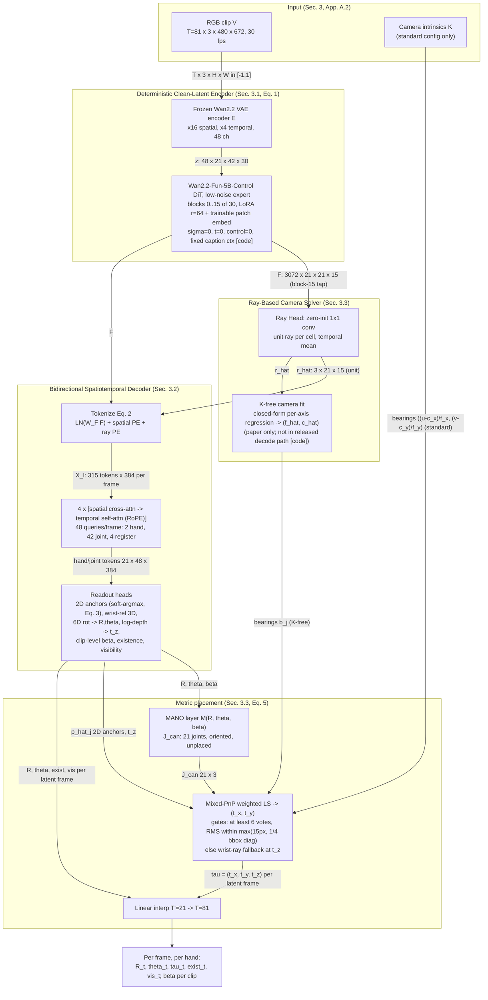
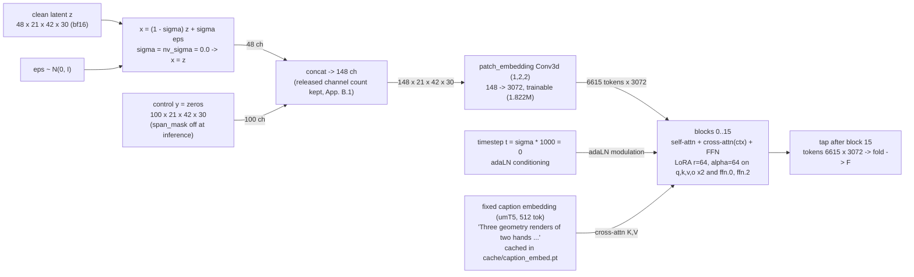
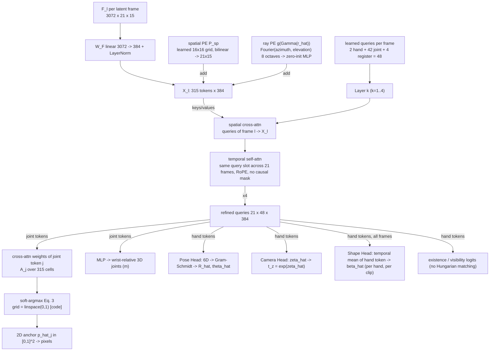
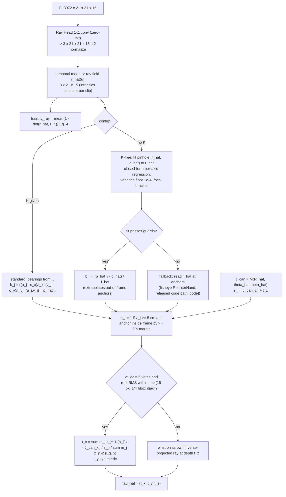
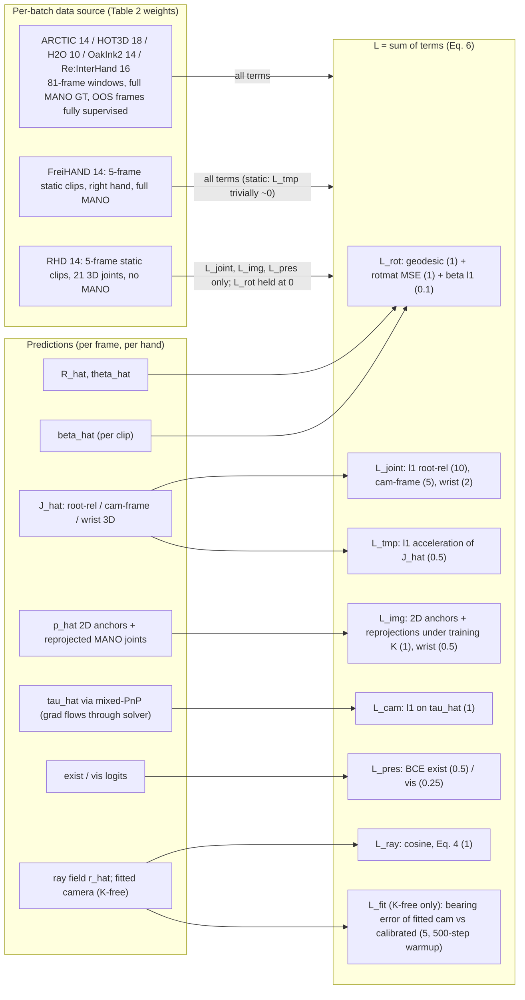
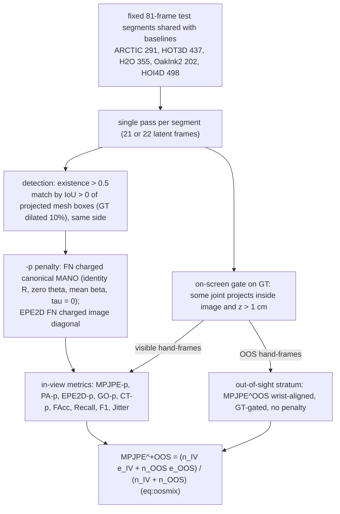

# ACE-Ego-Hand — Method Flowcharts

Source of truth for each box: paper section / equation IDs in brackets (`main.tex` v2), or `[code]` when the released repository (`ggxxii/ACE-Ego-Hand` @ `9757868`) is the only or the more precise source. Shapes assume the ARCTIC setting (81 frames, 672x480). Where paper and code disagree, the code value is drawn and the disagreement is flagged (see `ace-ego-hand-notes.md` §6.2 and `gaps_filled.md`).

Shape legend: `T=81` RGB frames, `T'=21` latent frames, `Hl x Wl = 42x30` VAE latent grid (16 px), `Hp x Wp = 21x15` DiT token grid (32 px, `[code]` default `tap_grid=patch`), `D=3072` backbone width, `d=384` decoder width.

---

## Figure 1 — Inference pipeline (one deterministic pass)

Note: the paper describes the feature grid as `42x30` cells of `16x16` px with `D=3072` (Sec. 3.1). The released code folds DiT tokens without undoing the `(1,2,2)` patchify, giving `21x15` cells of `32x32` px; the pixelshuffle variant (`tap_grid=pixelshuffle`, `D/4=768` ch at `42x30`) exists in code but is not enabled by the released configs.

---

## Figure 2 — Encoder input assembly at sigma = 0 (`[code]` `geodit_arch.py::extract_features`, `feature_mode=noised_video`)

Blocks 16..29 and the diffusion output head are never executed (App. B.1: their LoRA `B` matrices stay exactly zero).

---

## Figure 3 — Decoder: spatially grounded queries and alternating attention (Sec. 3.2, App. B.1)

Config anchors `[code]` `options/ace_ego_hand_k.yml`: `hidden_dim: 384`, `num_heads: 8`, `ffn_mult: 4`, `dropout: 0.0`, `alt_num_layers: 4`, `alt_num_register: 4`, `alt_query_mode: joint`, `alt_temporal_rope: true`, `betas_scope: per_hand`, `per_hand_betas_source: slot_mean`, `use_ray_pe: true`, `ray_pe_n_freqs: 8`.

---

## Figure 4 — Ray-Based Camera Solver and mixed-PnP decision flow (Sec. 3.3, Eq. 4-5, App. B.1)

Each configuration is a separately trained model with its own bearing source (Sec. 3.3); the K-free rows in Table 1 are not a test-time solver switch.

---

## Figure 5 — Training objective routing (Sec. 3.4, Eq. 6, App. B.3)

Optimizer (App. B.2): AdamW, wd 1e-2, clip 1.0, cosine, 200 warmup, 20k steps; LR 2e-4 decoder+heads, 1e-4 LoRA, 2e-5 patch embed; 4 clips/GPU; 16 A100 (standard, eff. batch 64) or 8 A100 (K-free, eff. batch 32).

---

## Figure 6 — Evaluation protocol (App. A.1)

Not released: segment IDs (HOT3D custom 126/72 recording split, OakInk2 202-subset, HOI4D 498 segments) and the scorer itself (GitHub issues #5, #6).
