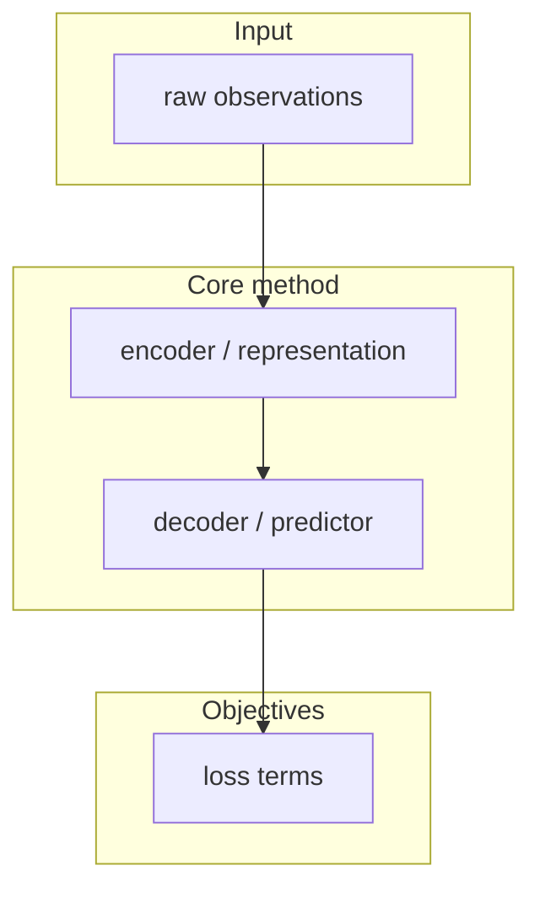

# Paper Replication Workflow

Cross-domain paper work is a pipeline, not a single skill. Read this first, then load the matching specialist skill and follow it fully.

Installed global skills live in `~/.cursor/skills/` (Windows: `%USERPROFILE%\.cursor\skills\`).

## Route the request

| User intent | Load next | Output |
| --- | --- | --- |
| Unfamiliar domain, critical notes, bilingual reading | `reading-papers` | `*-notes.md` |
| Benchmark / method / survey deep analysis | `paper-analysis` | type-routed analysis |
| Fast mechanism summary from a PDF | `summarize-paper` | `Summaries/*_summary.md` |
| Related work, open-source code, Papers with Code | `literature-research` | paper table + code links |
| arXiv → Markdown for implementation | `arxiv-doc-builder` | structured Markdown |
| Method flowchart / architecture diagram | see Drawing | Mermaid / TikZ / draw.io |
| Reconstruct algorithm as LaTeX pseudocode | `gen-pseudocode-skill` (`algo-reconstruct`) | algorithm2e `.tex` |
| Paper has no / incomplete code | `reproduce` | `repro/<arxiv-id>/` |
| Minimal citation-anchored implementation | `paper2code` | `model.py` + `REPRODUCTION_NOTES.md` |
| Ablation / experiment matrix | `experiment-design` | experiment plan |
| Training run failing / NaN / OOM | `debug` | evidence-first diagnosis |
| Compare two runs | `compare` | same-epoch comparison |

If the user wants the **full path** (read → diagram → code), walk the three stages below in order. Do not skip reading before coding.

## Stage A — Understand the paper

1. Get a readable source:
   - arXiv ID/URL → `arxiv-doc-builder` (LaTeX via pandoc if available; PDF fallback otherwise).
   - Local PDF → `summarize-paper`. If PDF MCP tools (`pdf_info`, `pdf_read_section`) are missing, read the PDF with available file tools and still follow `summarize-paper/template.md`.
2. Build domain understanding:
   - Default: `reading-papers` (six dimensions, bilingual, critical).
   - Method vs benchmark vs survey: also run `paper-analysis` and follow the matching `prompts/*.md`.
3. Optional explainer article with Mermaid: `paper-analyzer` (ask style: academic / concise / storytelling).
4. Stop and confirm with the user: one-paragraph "what this paper actually does", plus open questions.

Do not implement until you can name: inputs, outputs, loss, training loop, and every unspecified hyperparameter.

## Stage B — Draw the method

Pick **one** primary format unless the user asked for several:

| Need | Skill | Format |
| --- | --- | --- |
| Quick understanding / chat | Mermaid `flowchart TB` in Markdown | `.md` |
| Publication-quality 2D pipeline | `thesis-figure-skill` (default TikZ) or `research-figure` | `.tex` / `.drawio` |
| Method comic / overview figures | `paper-comic` (confirm style, count, language first) | images |
| 3D mesh / SMPL / teaser render | `research-figure` Blender path | render scripts |
| Algorithm block for the paper | `gen-pseudocode-skill` | algorithm2e |

Mermaid defaults for method papers:



Rules: node text ASCII-safe; one figure = one idea; label every edge with the tensor/role, not "then".

## Stage C — Reproduce (especially if closed-source)

1. Always start `reproduce` and walk stages 1–7. Read each `reproduce/references/0N-*.md` before that stage. Do not advance until the stage's success criteria pass.
2. If official code exists, clone it (`02-code-clone`) and fill gaps; do not rewrite from scratch.
3. If there is **no code**, still finish gap analysis (`03-gap-analysis.md`) first, then implement. Mark every invented value as `[unspecified — assumed X because Y]`.
4. For a small, citation-anchored PyTorch (or JAX/NumPy) core, run `paper2code` **in addition to** gap analysis — never instead of it.
   - Helper scripts: `%USERPROFILE%\.cursor\skills\paper2code\scripts\fetch_paper.py` and `extract_structure.py`.
5. New code follows `coding-standards` (and `python-ml.md` for PyTorch). Do not restyle cloned official repos until a number lands.
6. Private dataset → document substitution in `dataset_substitution.md`; do not pretend it is the original split.
7. After a runnable loop exists: `experiment-design` for the replication matrix, `debug` on failures, `compare` at the **same epoch**.
8. Before calling the implementation done, run `verification-before-completion`. After a large new module, run `code-review`.

Working directory:

```
repro/<arxiv-id>/
├── paper.md
├── inventory.md
├── gaps_filled.md
├── method-flowchart.md
├── code/
├── data/
└── results.md
```

## Honesty rules

- Quote paper section/equation IDs next to every architecture and hyperparameter choice.
- Missing detail → list it, pick a default, record the alternative.
- Do not refactor cloned official code before a number lands.
- Do not claim a reproduction succeeded without a metric table vs the paper, with epoch alignment.

## After install

New Agent chats pick up global skills automatically. Type `/` in Agent chat to see names. If a skill is missing from `/`, restart Cursor once.
